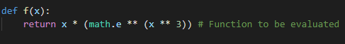
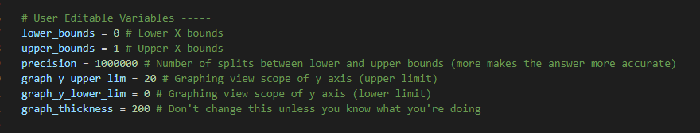
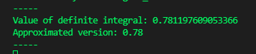
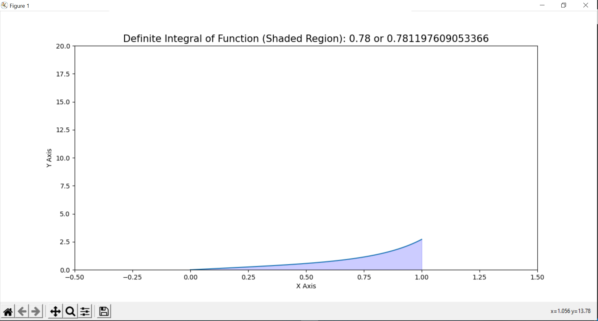

# Basic Integral Solver

This project takes a basic function and will output the definite integral answer alongside an interactive matplotlib graph.

Variables that you can play with:

* *lower_bounds* is the lower bound of the integral.
* *upper_bounds* is the upper bound of the integral.
* *precision* is the level of precision of the calculation. A higher number means more precision. Recommended is between 1,000 and 1,000,000.
* *graph_y_upper_lim* is the upper limit of the displayed graph.
* *graph_y_lower_lim* is the lower limit of the displayed graph.
* *graph_thickness* is how thick the displayed graph is.
* **Last, you have to manually enter in the mathematical function in the python function called *f* as a return.**

## Example

**This equation:**

**is entered as this in the code:**

**Then the variables are adjusted in the code as follows:**

**Then the integral is solved and printed to the console like this:**

**Then a graph pops up like this:**

